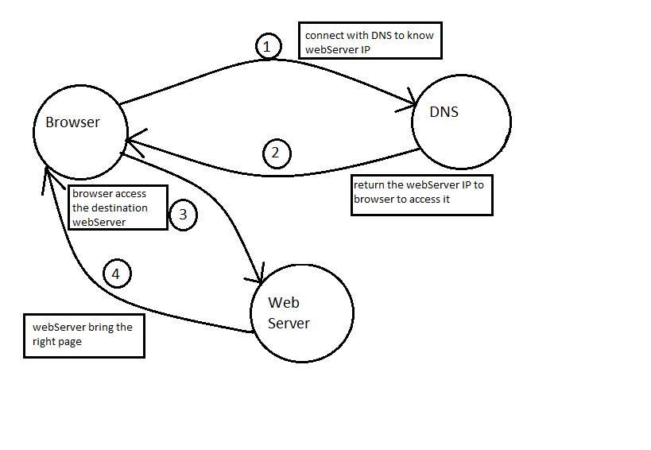

 ## First of all, when you need to access a webpage, what is the steps your browser had to do to access it?

 well you as a user open your browser and type the address or link of a website you want to access it (we call this process a request), your browser will take your request and connect with domain name server (DNS) (which hold information about servers like IP, MAC address... etc) to know the IP address for the webserver which hold your requested website **note** *this will happen if you access that webserver for the first time and your browser does not have its IP*. after DNS kowing the IP it will bring this information to you, and now you raedy to connect with that webserver to access the requested webpage. Simple as it ^^.
   
   
   .

### so now these webpages how it built? 
 
 **all webpages created by HTML and CSS**

 **HTML** stands for hyper-text markup language. hyper-text because html used links,markup because it used tags.

 html structure a webpage using tags,opening (<element_name) and closing(/element_name>) tag.each tag has different purpose to tell the browser something about the content inside of it.

the first version of html was released in 1993 by **Tim Berners-lee**
html4 released in 1997, it had some presentational elements to control the appereance of pages. In tha same year html4.01 released. In 1998 XML was publisged to allow people to write new markup language. after that in 2000 XHTML1.0 released the benifit of this combination was that html warks smoothly with other programs that are written in XML.also in 2000's html5 was released and it is the newest version.

 **the main tags in html:**

 1. `<!DOCTYPE html>`: to tell the browser which version this website use.
 2. `<html>`: to tell browrse you use html
 3. `<head>`: contains the information about this website like title and meta tags.
 4. `<body>`: contains any thing will be visible to users in your website.
  **note** each of these tags has opening and closing tag.Ex: `<head>  ..... </head>`

  you can add attributs which provides additional format on the content. each attribut has the name and the value.
#### some attributs:
1. id attribut(global attribut):used to make some element uniqe from others on the page.that means no two elements have the same value of their id.
2. class attribut:to identify several elements with the same attributs.

### meta tag `<meta>`:
meta tag contains infornation about webpages, it is an empty element it does not have the closing tag. it used the attributes to carry the information and the most common attributes are the name (its value is the property you are set it) and content (has the value that you want to give to this property)

**some name value**

1. description which contains the descriptionof the page.
2. keywords: contains a list of comma-separated word that user might search on to find the page.
3. robots: whether search engin should add this page to their search results or not.

**some common tags**

1. `<header> and <footer>`: used for the main header and footer of the page. or the header and the footer for a sections ot articles in the page.
2. `<nav>`: intended only for major block of navigation links.
3. `<article>`: container for any section of a page.
4. `<aside>`: defindes some contents aside from the content it is placed in.
5. `<section>`: to group related content togrther.
6. `
`: is used as a container for HTML elements.
7. `<hgroup>`: to group a set of one or more  heading elements together.
9. `<figure>`:specifies self-contained content, like illustrations, diagrams, photos, code listings, etc.
10. `<figcaption>`: contains the description for the content of the figure tag.  
11. `<h1> to <h6>`: for headings. `<h1>` for most important heading.
   - there are alot of tags in html. go search on your browser to check it ^^.
  - you can add comments in the code by using special characters.
  - you can add some symbols in your page like <,>, copyright "©" ,&. by typeits code.
  
### Before of creating a webpage you have to ask yourself some questions
#### who is the site for? because every website should be designed for the target audience and why people visit your site? and  why they would come to your site?, what information they want to find? and when they are likely to return?.

**some technique will help you when you create a website:**

- wireframe it helps you to organize the information that in each page.
- visual hierarchy helps you to know what is the inforamtion/highlight will make visitors understand what you are trying to tell them.

-----------------------------------------------------------
## CSS 
cascade style sheet, it allows you to create rules that control each elements representing (format/style your page).

**Rules contains two parts:**

1. selectors: means which element the rules will be appllied to it. there are many type of selectors such as: universal (`* {}`) all elements will be applied the same rules, type (`h1{}`) by type element's name all rules inside this selector will applied to the same element's name, class (`. {}`) to make some rules applied for seversl elements, id (`# {}`) to make some rules applied for specific element...etc.
2. declaration: how the element reffered to in the selector should be styled. 

- to link Css code in html file using `<link> tag `
- you can use Css internally in html using `<style>` tag but it is not the best practice.
------------------------------------------------

## JavaScript
JS is a programming language used to make the website more interactine and friendly with users. Script part means a series of instruction that a computer can follow to achieve something.

**Before coding any thing you should**

1. define your task you want to achieve it and represent it as steps.
2. use flowchart to represent the steps of ypur task into some shaps to make it easier to read.
3. now you can code each step.

**Computer** is a machine that don not know anything unless it learned/told to do something. to make this happen we use programming languages to communicate with these machines.

- in programming each physical thing can be represented as an object. each objecthas own properties, events and methods.

*properties: * is a subset of object have some information about the object.** for EX:** apple is an object, but color, shap and season are properties for the main object (apple). each property has a name and value tells you somthing about the object. 

*Events: * it is a way make computer interacte differently with objects depend on its value. When a specific event happens that event can be used to run a specific section of code called METHODS.

*Methods:* a block of code interacte with object when certain event comes.

**As a summary we can say** Events can run methods. and methods can update or return(make something) the object's properties.

Web browsers have the same thing:
1. window object: represented each window
2. document object: modelled each webpage loaded into window. so, it represents an html page.

**notice that** JS code runs when it is found in the html code. if you put it at the beginning of html code it will run before html code. 
therefore, browser will read html when `<script>` tag appeared it will stop running html to load the JS file until it finishs then return to html code. 

